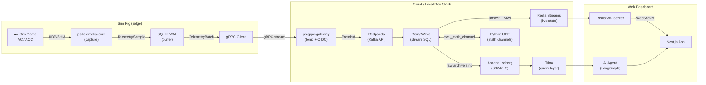
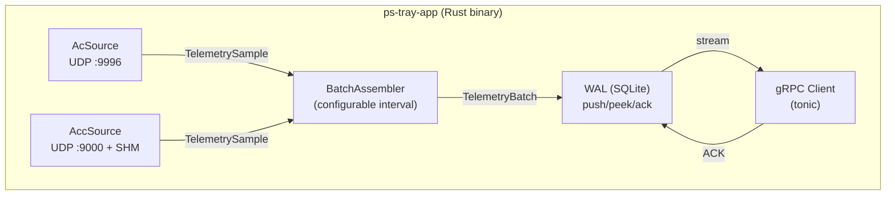
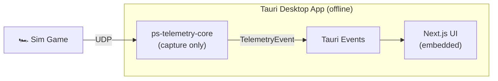
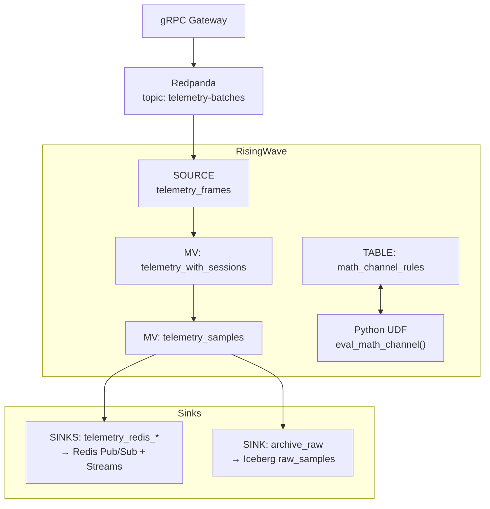
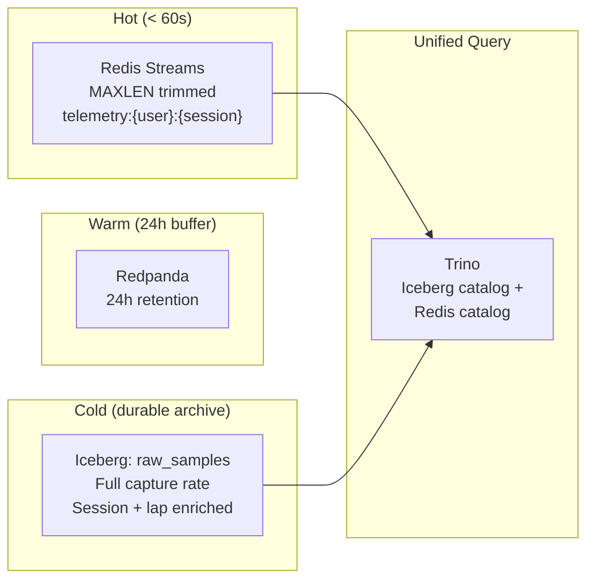

# Cloud Data Pipeline Architecture

> PurpleSector's cloud telemetry pipeline: from sim rig to web dashboard.

## Overview

The cloud pipeline captures real-time telemetry from racing simulators, streams it through a high-throughput ingestion layer, processes it with SQL-based stream processing, and delivers it to both a live web dashboard and a durable analytics lakehouse.

**Design philosophy:** Streaming Data Lakehouse (Kappa architecture evolution) — a single stream processing engine (RisingWave) replaces both the Kafka consumer and batch ETL jobs, producing real-time materialized views that sink to Redis (live) and Apache Iceberg (archive).

---

## End-to-End Data Flow



---

## Component Architecture

### Edge: Capture & Transport



**Key design decisions:**
- **`rusqlite::Connection` is `!Send`** — WAL operations run on a dedicated OS thread, communicating with the async runtime via `mpsc` channels (`WalCmd` enum).
- **Configurable batch window** — the batch interval is user-adjustable (100ms–1s). The `batch_size` field in every Protobuf message is the source of truth.
- **Zstd compression** on the gRPC wire (~60-80% reduction).

### Tauri Desktop App (Self-Contained, Free Tier)



- **No cloud connection** — completely offline, self-contained.
- Uses only the `capture` feature of `ps-telemetry-core` (no WAL, no gRPC, no batch assembler).
- Telemetry frames are emitted as Tauri events directly to the embedded Next.js UI.
- Math channels evaluated client-side (mathjs in browser).

### Cloud Pipeline Detail



### Storage Tiers



---

## Protobuf Schema

Single source of truth at `proto/telemetry.proto` (project root), shared by both Rust (`prost`/`tonic`) and Node.js (`protobufjs`).

```protobuf
// proto/telemetry.proto
message TelemetryFrame {
  int64  timestamp           = 1;
  float  speed               = 2;
  float  throttle            = 3;
  float  brake               = 4;
  float  steering            = 5;
  int32  gear                = 6;
  int32  rpm                 = 7;
  float  normalized_position = 8;
  int32  lap_number          = 9;
  int32  lap_time            = 10;
  optional float session_time     = 11;
  optional int32 session_type     = 12;
  optional int32 track_position   = 13;
  optional int32 delta            = 14;
}

message TelemetryBatch {
  string user_id       = 1;
  string session_id    = 2;
  int64  batch_start_ts = 3;
  int64  batch_end_ts   = 4;
  uint32 batch_size     = 5;   // Source of truth for sample count
  uint32 source_rate_hz = 6;   // Capture rate (AC ~60Hz, ACC ~10Hz)
  repeated TelemetryFrame samples = 7;
}
```

---

## Authentication

The gRPC gateway uses **OIDC/JWKS-based JWT validation**, compatible with any identity provider (Auth0, Clerk, Keycloak, Cognito, etc.).

| Environment Variable | Description |
|---------------------|-------------|
| `AUTH_ISSUER_URL` | OIDC issuer URL (e.g., `https://purplesector.us.auth0.com/`) |
| `AUTH_AUDIENCE` | Expected JWT audience claim |
| `AUTH_JWKS_URL` | Explicit JWKS endpoint (auto-discovered if omitted) |
| `AUTH_DISABLED` | Set `true` to bypass auth in local dev |

---

## Local Development

### Prerequisites
- Docker & Docker Compose
- Rust toolchain (`rustup`)
- Node.js 18+
- System packages: `protobuf-compiler`, `cmake`, `libcurl4-openssl-dev`, `libssl-dev`

### Quick Start

```bash
# 1. Start the cloud infrastructure
docker compose -f docker-compose.dev.yml up -d

# 2. Apply RisingWave SQL migrations
psql -h localhost -p 4566 -d dev -f infra/risingwave/001_sources.sql
psql -h localhost -p 4566 -d dev -f infra/risingwave/002_materialized_views.sql
psql -h localhost -p 4566 -d dev -f infra/risingwave/003_redis_sinks.sql
psql -h localhost -p 4566 -d dev -f infra/risingwave/004_math_channels.sql
psql -h localhost -p 4566 -d dev -f infra/risingwave/005_iceberg_connection.sql
psql -h localhost -p 4566 -d dev -f infra/risingwave/006_iceberg_sinks.sql

# 3. Run the gRPC gateway locally
cd rust && cargo run -p ps-grpc-gateway

# 4. Run the tray app (captures telemetry + streams to gateway)
cd rust && cargo run -p ps-tray-app

# 5. Start the Redis WebSocket server
node services/redis-websocket-server.js

# 6. Start the Next.js dev server
npx nx serve web

# 7. (Optional) Replay demo data through the pipeline
cd rust && cargo run -p ps-demo-replay -- --file public/demo-telemetry.json
```

### Docker Compose Services

| Service | Ports | Description |
|---------|-------|-------------|
| Redpanda | 9092, 8081, 8082 | Kafka API, Schema Registry, HTTP Proxy |
| Redpanda Console | 8090 | Web UI for topics/messages |
| RisingWave | 4566, 5691 | SQL endpoint, Dashboard |
| Redis | 6379 | Live telemetry streams |
| MinIO | 9000, 9001 | S3 API, Console |
| Trino | 8083 | Query engine |
| Postgres | 5432 | App metadata DB |

---

## Rust Workspace

```
proto/
└── telemetry.proto                # Consolidated Protobuf schema (single source of truth)

rust/
├── Cargo.toml                     # Workspace manifest
└── crates/
    ├── ps-telemetry-core/         # Shared library
    │   ├── src/
    │   │   ├── lib.rs
    │   │   ├── proto.rs           # Generated protobuf types
    │   │   ├── capture/
    │   │   │   ├── mod.rs         # TelemetrySource trait, CaptureConfig
    │   │   │   ├── ac.rs          # Assetto Corsa capture
    │   │   │   └── acc.rs         # ACC capture (UDP + SHM)
    │   │   ├── wal.rs             # SQLite WAL (cloud-transport)
    │   │   ├── batch.rs           # Batch assembler (cloud-transport)
    │   │   └── grpc.rs            # gRPC client (cloud-transport)
    │   └── Cargo.toml
    ├── ps-tray-app/               # System tray app (capture + cloud)
    ├── ps-demo-replay/            # Demo data replay tool
    └── ps-grpc-gateway/           # Cloud gRPC ingress service
```

### Feature Flags (`ps-telemetry-core`)

| Feature | Default | Modules | Used By |
|---------|---------|---------|---------|
| `capture` | ✅ | `capture::*`, `proto` | Tauri app, tray app |
| `cloud-transport` | ❌ | `wal`, `batch`, `grpc` | Tray app only |

---

## Math Channels

User-defined math channels are evaluated server-side in RisingWave via a Python UDF.

**Flow:**
1. User creates expression in web UI (same `MathChannelForm` + mathjs syntax).
2. API writes rule to both Prisma `MathChannel` table and RisingWave `math_channel_rules` table.
3. RisingWave joins incoming samples with rules and calls `eval_math_channel()` UDF.
4. Computed values flow through the same sink pipeline (Redis + Iceberg).

**Special functions:** `derivative(x)` and `integral(x)` are stateful operations implemented as dedicated RisingWave SQL using `LAG()` and cumulative `SUM()` window functions.

---

## Migration Path

### From Current Stack
| Old | New | Status |
|-----|-----|--------|
| Node.js AC/ACC collectors | `ps-telemetry-core` (Rust) — `AcSource`, `AccSource`, `DemoSource` | Done |
| `kafka-websocket-bridge.js` | `redis-websocket-server.js` | Done |
| `kafka-database-consumer.js` | RisingWave → Redis + Iceberg sinks | Done |
| `docker-compose.kafka.yml` | `docker-compose.dev.yml` | Done |
| Confluent Kafka + Zookeeper | Redpanda (single binary) | Done |
| `@purplesector/kafka` wrapper + `kafkajs` | Rust `rdkafka` (gateway) | Done |
| Client-side mathjs eval | RisingWave UDF + `computed_math_channels` MV | SQL + UDF ready |
| SQLite (app metadata) | PostgreSQL (cloud) | Schema ready |

### Trino → StarRocks
All query access goes through an abstraction layer (Query Service). Swapping Trino for StarRocks is a config change + query template swap, not an architecture change. See the plan document for details.
